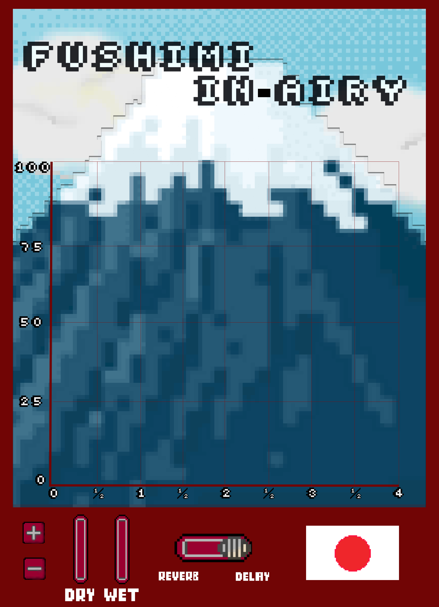
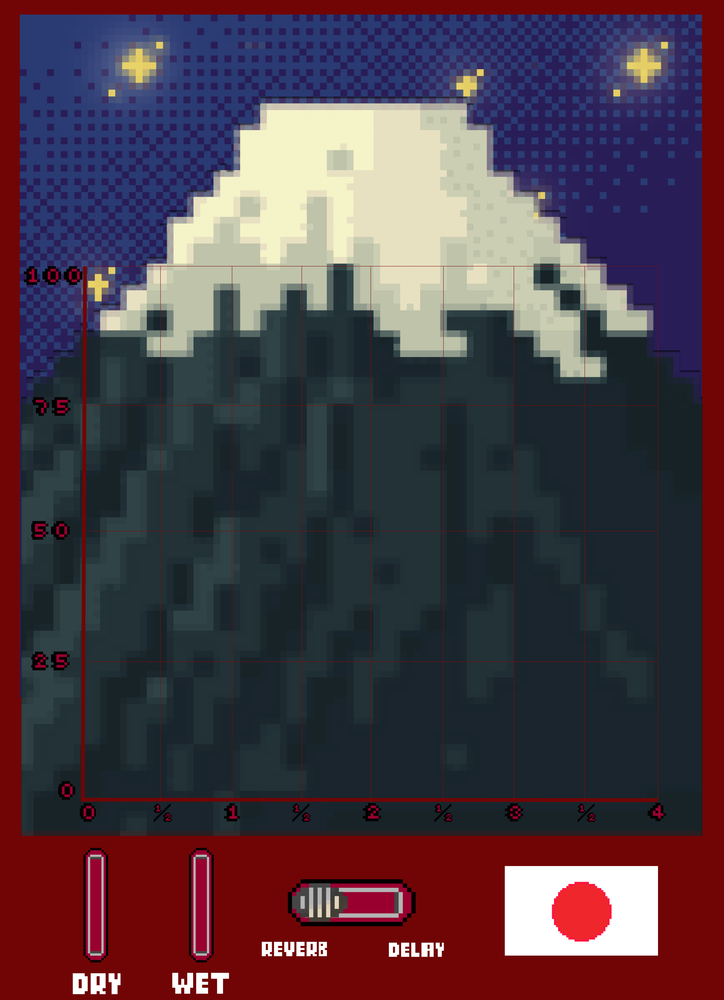
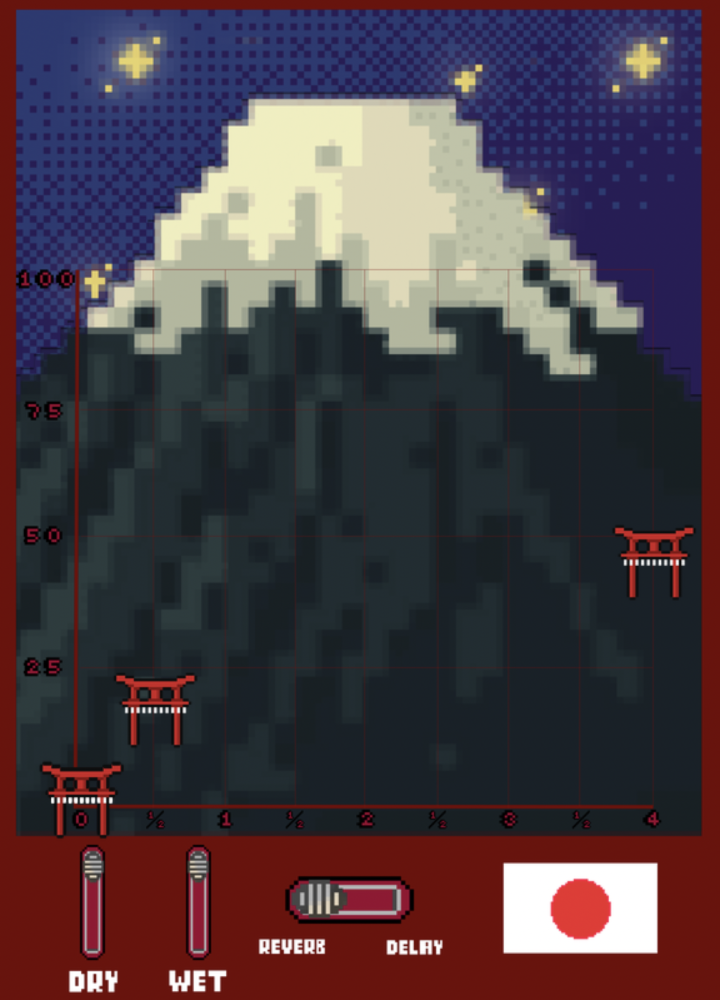

# fushimi-in-airy 
### Delay-Reverb plug-ins. Kyoto based.

A dual-mode audio plugin featuring multi-tap delay and multi-instance reverb effects, inspired by Japanese aesthetics and the Fushimi Inari shrine.

**Created by:** Leela Koushik Korampalli & Marino Oliveros Blanco

[](https://www.python.org/downloads/)
[](https://numpy.org/)
[](https://librosa.org/)
[](https://numba.pydata.org/)
[](https://docs.python.org/3/library/tkinter.html)
[](#license)

## Features

### 🌅 Delay Mode (Morning Theme)
- **Multi-tap delay** with up to 5 independent delay taps
- **X-axis:** Time delay (0-4 seconds / 4 bars based on BPM)
- **Y-axis:** Volume (0-150% of dry signal)
- Climbing the mountain - delays trigger as audio reaches each gate position



### 🌙 Reverb Mode (Night Theme)
- **Multi-instance reverb** using Schroeder algorithm
- **X-axis:** Decay time (0-10 seconds)
- **Y-axis:** Volume (0-100% of dry signal)
- **Numba-optimized** for real-time performance
- Descending the mountain - reverbs start immediately and decay over time




### Controls
- **5 Torii Gates:** Draggable on mountain grid (X = time/decay, Y = volume)
- **Dry Knob:** Original signal volume (0-100%)
- **Wet Knob:** Effect signal volume (0-100%)
- **Mode Switch:** Toggle between Delay and Reverb modes (press 'M' or click switch area)
- **On/Off Button** Japan Flag shaped button to turn plug in on or off


## Installation - Development

### Requirements
```bash
pip install tkinter pillow numpy librosa soundfile pygame numba --break-system-packages
```

### Dependencies
- **tkinter:** GUI framework
- **PIL/pillow:** Image loading and processing
- **numpy:** Audio array operations
- **librosa:** Audio file loading
- **soundfile:** Audio file saving
- **pygame:** Audio playback
- **numba:** JIT compilation for reverb performance

---

## File Structure

```
Fushimi-In-Airy/
├── fushimi_plugin_demo.py              # Main GUI application
├── reverb/
│   └── reverb_engine.py        # Schroeder reverb implementation
├── delay/
│   └── DelayV1.py              # Delay engine and demo
├── gui/
│   ├── backgrounds/
│   │   ├── background_delay.png    # Morning theme
│   │   └── background_reverb.png   # Night theme
│   └── icons/
│       ├── gates/
│       │   ├── torii1.png - torii5.png
│       └── knobs/
│           ├── dry_knob.png
│           └── wet_knob.png
└── examples/
    ├── delay/
    │   └── minecraft-firework.mp3  # Example audio
    └── reverb/
```

###  Workflow

1. **Position Torii Gates** on the mountain grid
   - Click and drag any gate
   - X position = Time (delay) or Decay (reverb)
   - Y position = Volume/Gain

2. **Adjust Dry/Wet Mix**
   - Drag knobs up (louder) or down (quieter)
   - Top = 100%, Bottom = 0%

3. **Switch Modes**
   - Press **'M'** key
   - Or click the mode switch area at the bottom

4. **Process Audio**
   - Release mouse after moving gates or knobs
   - Audio automatically processes and plays

## Mode Details

### Delay Mode

**How it works:**
- Each gate represents one delay tap
- Audio plays once through the plugin
- When the "playback cursor" reaches each gate's X position, the delay triggers at that gate's Y volume
- Multiple taps create rhythmic echo patterns

**Parameters:**
- **X-axis:** 0 to 4 bars (based on BPM, default 120)
- **Y-axis:** 0% to 150% of dry signal (0 to +3.5 dB)

**Example Settings:**
```
Slapback Echo:
- Gate 1: X=200ms, Y=70%
- Others at bottom (silent)

Rhythmic Delay:
- Gates at 1/4, 1/2, 3/4, 1, 2 bars
- Decreasing volume left to right


```

### Reverb Mode

**How it works:**
- Each gate represents one independent reverb instance
- All reverbs start simultaneously
- Each decays based on its X position (decay time)
- Volume controlled by Y position
- Layered reverbs create rich spatial effects

**Parameters:**
- **X-axis:** 0 to 10,000ms (10 seconds) decay time
- **Y-axis:** 0% to 100% of dry signal (0 to -∞ dB)

**Example Settings:**
```
Small Room:
- Gate 1: X=2000ms, Y=60%

Cathedral:
- Gate 1: X=8000ms, Y=40% (main)
- Gate 2: X=10000ms, Y=20% (tail)

# 

---
## Audio Specifications

**Supported Input Formats:**
- MP3
- WAV
- Any format supported by librosa

**Output Format:**
- WAV (uncompressed)
- 44.1 kHz sample rate
- Mono

**Processing:**
- Automatic stereo-to-mono conversion
- Normalization to prevent clipping
- Preserves sample rate from input

---

## Algorithm Details

### Delay Formula
```
output[n] = dry_signal[n] × dry_mix + 
            Σ(delay_tap[i] × wet_mix × signal[n - delay_samples[i]])
```

### Reverb Components

**Comb Filter:**
```
y[n] = x[n] + g × y[n-D]
```

**Allpass Filter:**
```
y[n] = -g × x[n] + x[n-D] + g × y[n-D]
```

**Decay Envelope:**
```
envelope[n] = exp(-5n / decay_samples)
```

---

## 🎎 Credits 

**Developers:**
- Leela Koushik Korampalli
- Marino Oliveros Blanco

**Inspiration:**
- Fushimi Inari Shrine, Kyoto, Japan
- Frost Children
- Valhalla Reverb

**Algorithms:**
- Schroeder, M. R. (1962). "Natural Sounding Artificial Reverberation"
- Classic multi-tap delay design

---

## License

This project is licensed under the MIT License - see the [LICENSE](LICENSE) file for details.

Copyright (c) 2026 Marino Oliveros Blanco & Leela Koushik Korampalli 